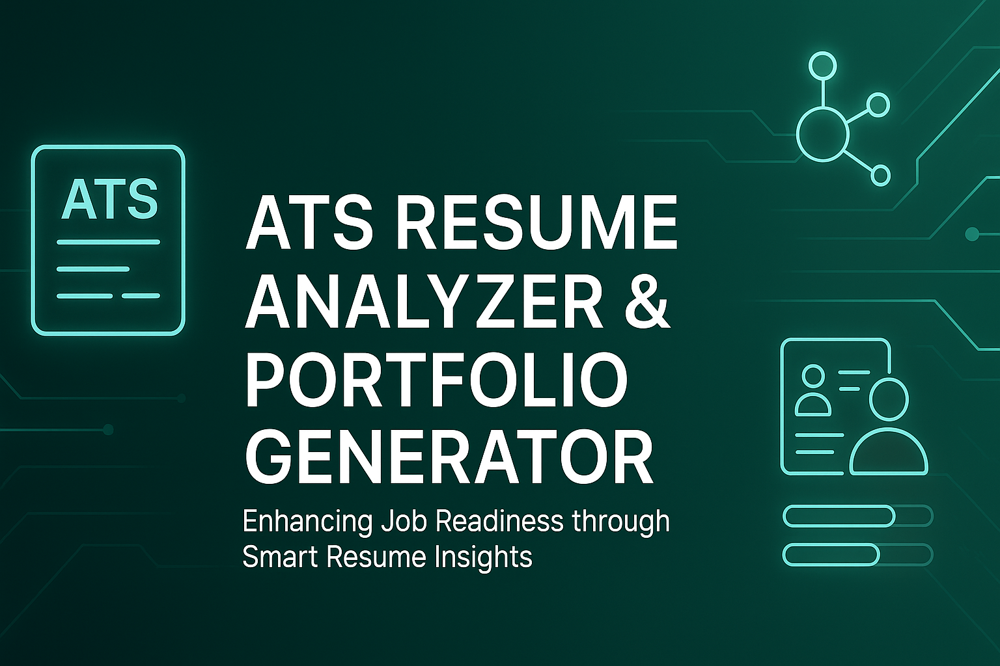

<p align="center">
  
</p>

<h1 align="center">🚀 JobTuner – ATS Resume Analyzer & Portfolio Generator</h1>

<p align="center">
  <b>Enhancing Job Readiness through ATS-Based Resume Analysis and Portfolio Generation</b><br>
  <i>A privacy-first, browser-based tool to analyze resumes, improve ATS scores, and auto-generate professional portfolios.</i>
</p>

<p align="center">
  
  
  
  
</p>

## 🧭 Overview
**JobTuner** is an intelligent web app that empowers users to optimize their resumes for **Applicant Tracking Systems (ATS)** and build exportable portfolios — all without uploading any data to a server.  
Everything runs **locally in your browser**, ensuring 100% privacy and instant results.


## ✨ Key Features

| Feature | Description |
|----------|-------------|
| 💼 **ATS-Based Resume Scoring** | Calculates ATS score, identifies missing sections & keywords |
| 🔍 **Keyword Match Analysis** | Compares resume vs. job description for keyword alignment |
| 🧠 **Smart Line Generator** | Suggests actionable, keyword-rich resume bullet rewrites |
| 🪄 **Portfolio Generator** | Creates portfolio in HTML, PDF & README formats |
| ⚡ **Fast & Local Processing** | Entire analysis executes in-browser — no data uploaded |
| 📊 **Multi-format Export** | Export results as JSON, CSV, PDF, or Markdown |
| 🔒 **Privacy First** | Uses LocalStorage for saving last session securely |


## 🧩 Tech Stack

| Layer | Technology / Library | Purpose |
|--------|----------------------|----------|
| **Front-End** | HTML5, TailwindCSS, Vanilla JS | Responsive, lightweight UI |
| **Resume Parsing** | pdf.js, mammoth.js | Extract text from PDF/DOCX resumes |
| **Data Processing** | Custom JS (tokenization, stemming) | Keyword & ATS logic |
| **Visualization** | Lucide Icons, Progress Bars | Clean and modern dashboard |
| **Report Generation** | jsPDF, AutoTable | Generates printable ATS reports |
| **Portfolio Export** | HTML, Markdown, PDF | Auto-creates personal portfolio |
| **Storage** | LocalStorage API | Stores last session locally |


## ⚙️ Setup & Usage

### 🔧 Clone Repository
```bash
git clone https://github.com/your-username/jobtuner.git
cd jobtuner
````

### ▶️ Run Application

Simply open `index.html` in your browser, or use a local server:

```bash
npx serve
```

Then visit:

```
http://localhost:3000
```


## 🧠 How It Works

1️⃣ **Upload Resume** – Accepts PDF or DOCX files.
2️⃣ **Paste Job Description** – Optional but boosts accuracy.
3️⃣ **Analyze** – Get ATS score, keyword match %, and suggestions.
4️⃣ **Smart Lines** – Instantly improve your bullets with AI-style guidance.
5️⃣ **Generate Portfolio** – Export results as HTML, PDF, or README.md.


## 📈 Performance Summary

| Parameter                  | Average Result |
| -------------------------- | -------------- |
| Resume Parsing (PDF <1MB)  | 1.8s           |
| Resume Parsing (DOCX <1MB) | 1.3s           |
| JD Keyword Comparison      | 0.9s           |
| ATS Score Computation      | 0.5s           |
| Portfolio Generation       | 2.2s           |
| Memory Usage               | ~80 MB         |
| Crashes / Downtime         | None observed  |


## 💬 User Feedback Highlights

| Feedback Parameter   | Satisfaction | Remarks                            |
| -------------------- | ------------ | ---------------------------------- |
| ATS Score Accuracy   | 92%          | Improved resume alignment          |
| Smart Line Generator | 88%          | Simplified resume enhancement      |
| Portfolio Generation | 95%          | Saved time and looked professional |
| Interface Usability  | 90%          | Intuitive and easy to navigate     |
| Privacy Assurance    | 94%          | Trusted local-only analysis        |

> “This tool not only improved my resume’s ATS score but also gave me a polished portfolio for interviews!” — *Student User*


## 🔐 Privacy by Design

No data leaves your browser — period.
All analysis, keyword matching, and portfolio generation are handled **locally**.
No APIs, no cloud storage, no third-party tracking.


## 🌍 Future Enhancements

* 🤖 AI-powered semantic keyword matching
* 🧾 Resume template generator
* 🎨 Dark mode and theming options
* ☁️ Optional cloud portfolio publishing
* 🔄 Integration with LinkedIn / GitHub APIs


## 🧑‍💻 Contributors

| Name                  | Role                               |
| --------------------- | ---------------------------------- |
| **Aaryan Maheshwari** | Developer & UI Designer            |
| **Chayan Gope**       | System Architect & Logic Developer |

🎓 *Chandigarh University, Department of Computer Science & Engineering*


## 🪪 License

This project is released under the **MIT License** — you are free to use, modify, and distribute it with proper attribution.


## ⭐ Support

If you like this project:
🌟 **Star this repo** to show your support
🐛 **Report bugs** or suggest features in [Issues](../../issues)
🔁 **Fork it** and create your own version


<p align="center">
  <b>Built with ❤️ by Aaryan Maheshwari & Chayan Gope</b><br>
  <i>Empowering job seekers through smarter resumes and portfolios.</i>
</p>
